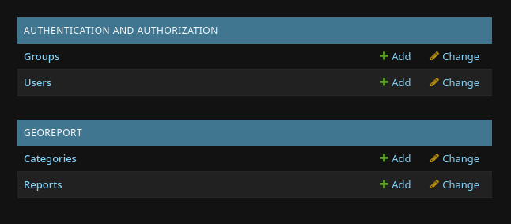
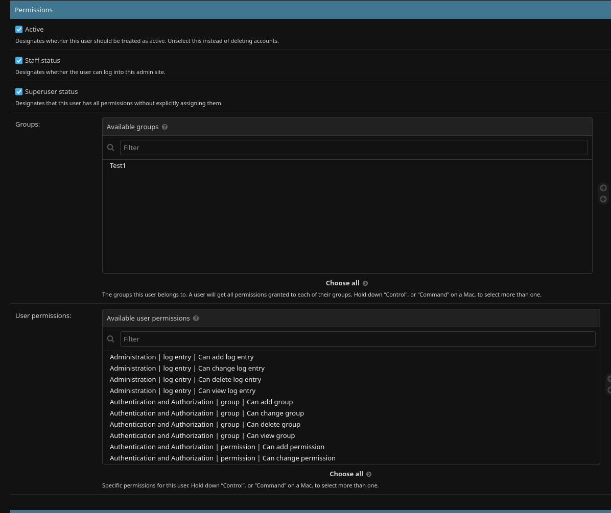
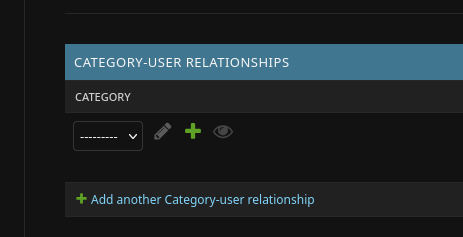
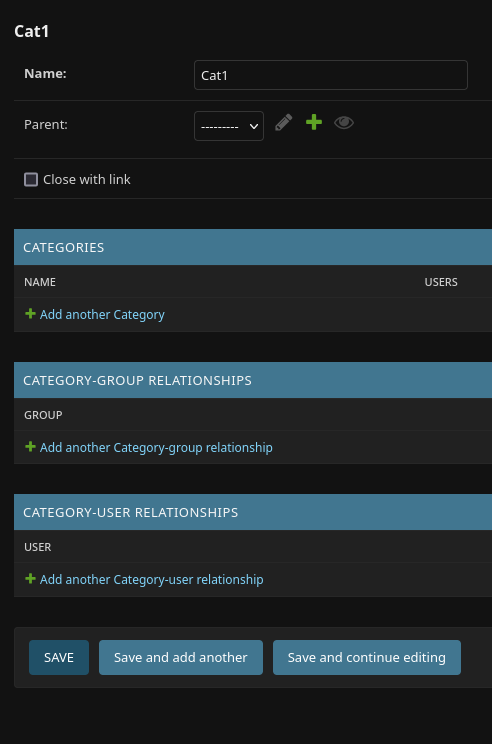
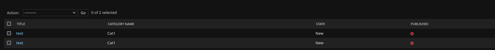

Usage
=====

In the following there is a short descirption on how to use the pinpoint-report app.
The information given here are only on how to handle the admin-page. Therefore,
it is assumed, that the webapp is running and that a superuser is already created.

--------------------
Site-Administration
--------------------

After logging in the user sees to Groups, Authentication and Georeport.
In each group there are links, which represent the registered models.
The authentication-group includes the *user* and *group* models.
The georeport-group on the other hand contains the *Category* and the *Report* model.

Here it is possible to add a new object to the chosen model, although it is not recommended to add a report in this way. 
Furhtermore it is possible to go the change page for a model, by either clicking on change or by clicking on the model name.

------
Group
------
Groups are a model, which enables to give different permissions to all users belonging to the afformentioned group. 
Here it is recommended to add all permissions, which can be found by searching for georeport, since the finer access control to reports and groups is done by categories. 

.. image :: ../images/group-change.png

-----
Users
-----

For users there are two views, one for creating a user and one for changing. 
The creation of a user should be straight forward, except for the added category, which will be explained furhterdone.

In order to be able to login, a user must have a password and also the *staff-status* must be assigned.
Furthermore it is possible to choose groups, permissions and categories. The later to can also be given to a user by the first one.

While groups and permissions are choosen in a list view, where it is also possible to add multiple at once, categories are added one at a time.

If a category is assigned to a user, the user will receive emails about changes in the reports under this categoy. Furthermore, if all base permissions are 
given, the user is able to change the category and reports belonging to this category.
  

--------
Category
--------

While changing (or creating) a category, it is possible to choose a parent to get a hierachical category tree.
Furthermore it is also possible to add the category to users or groups here. 

An important setting here is the *Close with link*, which enables the webapp to send closing links if checked.

-------
Report
-------

In the report-list, it is possible to the category, the state, and the published-status of a report, next to its name.
Here it is also possible to publish multiple reports at once, by selecting them and then choosing the action *publish selected reports*.

In the change view for a single report, it is possible to see every information about the report and most of them can be changed.
Further more an image preview is available, for images, which are linked to the report. 

